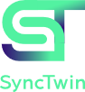

# About Us

## Michael T. Wagner

**[Michael Wagner](https://www.linkedin.com/in/michael-wagner-64873328/)** is CTO and co-founder off **[ipolog GmbH](https://www.ipolog.ai)** and CEO of its youngest spin-off, **[SyncTwin GmbH](https://www.synctwin.ai)**.

Since the late 1990s, he has been passionately developing innovative solutions for **Smart Factories** and **distributed virtual environments**, spanning a wide range of applications—from empowering manufacturing workers to enabling digital twins for autonomous robots, including Mars exploration scenarios.

In addition to his entrepreneurial work, Michael is an **NVIDIA Omniverse Ambassador**, where he actively promotes **OpenUSD-based workflows** and knowledge sharing across industry and education.

He is also a **NVIDIA Certified Professional: OpenUSD Development**, underlining his hands-on expertise in building scalable, OpenUSD-driven digital twin solutions.

## SyncTwin GmbH

**[SyncTwin](https://www.synctwin.ai)** helps innovation managers in **small and medium-sized enterprises (SMEs)** take their first practical steps with **NVIDIA Omniverse** and **OpenUSD**.

We typically start with **small, focused pilot projects** that address concrete business challenges—such as simulating container transport, supporting work and resource planning, or optimizing factory layouts. This hands-on approach allows teams to understand both the **technical potential** and the **business value** of these technologies early on.

Our long-term ambition is to become the **trusted entry point for SMEs into the Industrial Metaverse**, supporting them from initial exploration to sustainable, real-world adoption.

