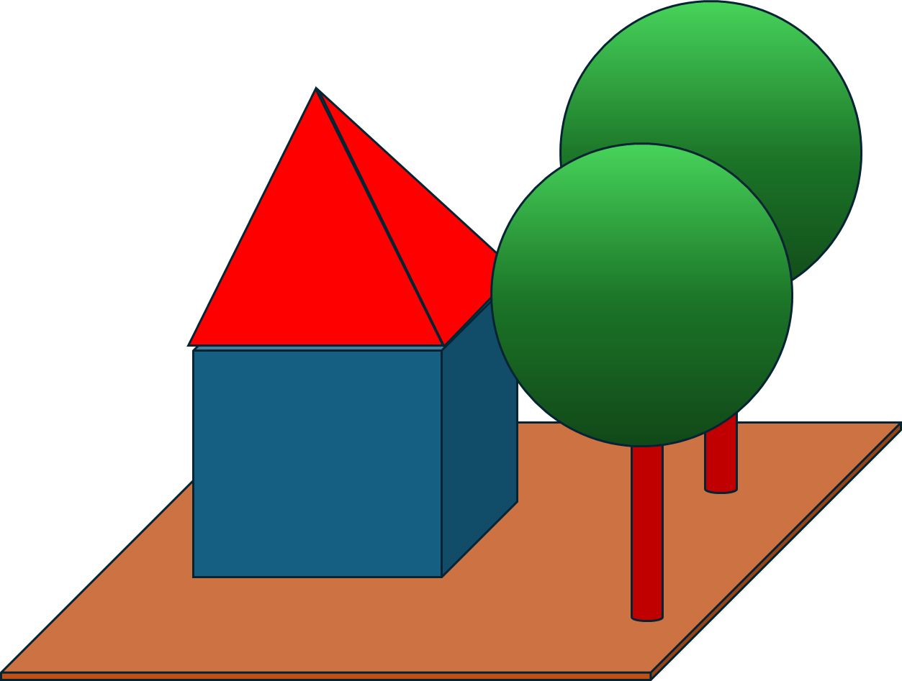

# 2025-09-19 - Stages / Prims / Attributes

## Aufzeichnung
[Aufzeichnung](https://youtu.be/f4PpSJZZeHU)


## Hauptthemen

### Python Umgebung einrichten & aktivieren 
[NVIDIA Dokumentation](https://nvidia-omniverse.github.io/LearnOpenUSD/usdview-install-instructions.html)

#### Python venv einrichten 

```powershell
Windows PowerShell
Copyright (C) Microsoft Corporation. All rights reserved.

PS C:\usd_root> .\python\python.exe -m venv .\python-usd-venv
```

#### Python venv aktivieren 

```powershell
PS C:\usd_root> .\python-usd-venv\Scripts\activate
(python-usd-venv) PS C:\usd_root>

```

#### USD-Core installieren & testen 

```powershell

(python-usd-venv) PS C:\usd_root>pip install usd-core

(python-usd-venv) PS C:\usd_root>python -c "from pxr import Usd;print(Usd.GetVersion())"

```

Wenn ein Fehler kommt müssen vielleicht die VC redistributables installiert werden:

[x64 Redistributables](https://aka.ms/vs/17/release/vc_redist.x64.exe),
siehe 
[Microsoft Support](https://learn.microsoft.com/de-de/cpp/windows/latest-supported-vc-redist?view=msvc-170)


#### Jupyter Notebook Support installieren 


```powershell
(python-usd-venv) PS C:\usd_root> pip install ipykernel

python -m ipykernel install --user --name=python-usd-venv --display-name "OpenUSD Studierstube (python-usd-venv)"

```
Dann Visual Studio Code neu starten

#### VSCode Jupyter Extension aktivieren 
(in Extensions nach "Jupyter" suchen)

#### Test : 

View->Command Palette -> Create: New Jupyter Notebook

## Lernschritte

- [What Is a Stage?](https://nvidia-omniverse.github.io/LearnOpenUSD/stage-setting/stage.html)
- [Prims](https://nvidia-omniverse.github.io/LearnOpenUSD/stage-setting/prims.html)

## Hausaufgabe

Baue eine USD-Szene in dieser Art mit den Grundelementen zusammen : 



