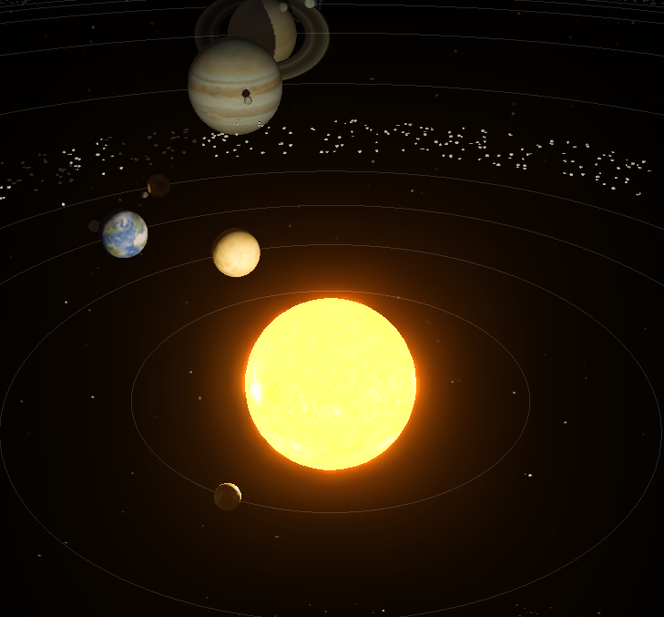

# 2025-10-10 - 

## Aufzeichnung
[Aufzeichnung](https://youtu.be/OSvjhSUTSYE)

## Themen
- Relationship attributes erstellen: 
[Dokumentation](https://docs.omniverse.nvidia.com/dev-guide/latest/programmer_ref/usd/properties/create-relationship.html)

- USD Learning Path Website ist umgezogen: [Link](https://docs.nvidia.com/learn-openusd/latest/index.html)

- Attribute Interpolation 
Zwischen Attributwerten mit Keyframes wird Linear interpoliert oder der Wert pro Intervall bleibt konstant, das kann man Stage-weit setzen mit SetInterpolationType().

Aus [Dokumentation](https://openusd.org/release/api/class_usd_attribute.html#Usd_AttributeInterpolation):

​    
>    UsdAttribute supports two interpolation behaviors when retrieving attribute values at times where no value is explicitly authored. The desired behaviormay be specified via UsdStage::SetInterpolationType. That behavior will be used for all calls to UsdAttribute::Get.

>   Note that for attributes with spline value sources, the interpolation behavior is determined by the spline itself, and the interpolation type set on the stage is ignored.

>    The supported interpolation types are:

>    *Held*: Attribute values are held constant between authored values. An attribute's value will be equal to the nearest preceding authored value. If there is no preceding authored value, the value will be equal to the nearest subsequent value.

>    *Linear*: Attribute values are linearly interpolated between authored values.

## Lernschritte

- [Timecodes/-Samples](https://docs.nvidia.com/learn-openusd/latest/stage-setting/timecodes-timesamples.html)

## Hausaufgabe

[Sonnensystem](https://w21030911.nuwebspace.co.uk/graphics/assessment/)

