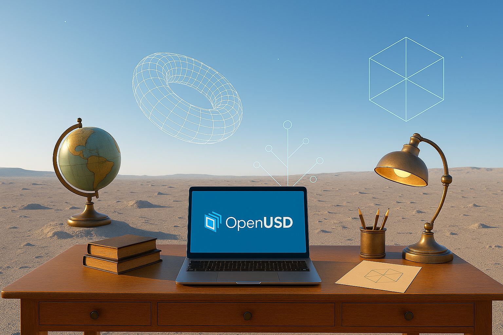

# Willkommen zur OpenUSD Studierstube! 🚀

Herzlich willkommen zur **OpenUSD Studierstube** – eurer virtuellen Lernbegleitung für die [NVIDIA OpenUSD Zertifizierung](https://www.nvidia.com/en-us/learn/certification/openusd-development-professional/)!

## Was erwartet euch?

Jeden **Freitag um 15:00 (CEST)** treffen wir uns in einer kompakten Teams-Session, um gemeinsam den kostenlosen [OpenUSD Learning Path](https://docs.nvidia.com/learn-openusd/latest/index.html) zu erkunden. Wir nehmen uns pro Termin eine Episode vor, besprechen die wichtigsten Konzepte und beantworten eure Fragen.

## Diese Website begleitet euch dabei

Diese Seite dient als euer digitaler Begleiter für die OpenUSD Studierstube:

- **📚 Material & Ressourcen**: Zusätzliche Lernmaterialien und Links zum OpenUSD Learning Path
- **🎥 Aufzeichnungen**: Die Aufzeichnungen unserer virtuellen Treffen zum Nachschauen
- **❓ FAQ & Fragen**: Häufig gestellte Fragen und Antworten aus unseren Sessions
- **📝 Notizen**: Zusammenfassungen und wichtige Erkenntnisse aus den Treffen

## Mitmachen ist einfach!

Wenn du bei den virtuellen Treffen dabei sein möchtest, kommentiere einfach auf [LinkedIn](https://www.linkedin.com/feed/update/urn:li:activity:7372237621541904384/) mit **"OpenUSD Studierstube"** oder schreib eine [mail](mailto:michael.wagner@synctwin.ai).

!!! success "Bereit für die Zertifizierung?"
    Gemeinsam schaffen wir das! Die OpenUSD Studierstube macht den Einstieg in die Welt von Universal Scene Description (USD) so einfach wie möglich. Hier gehts zur [Zertifizierung](https://www.nvidia.com/en-us/learn/certification/openusd-development-professional/)