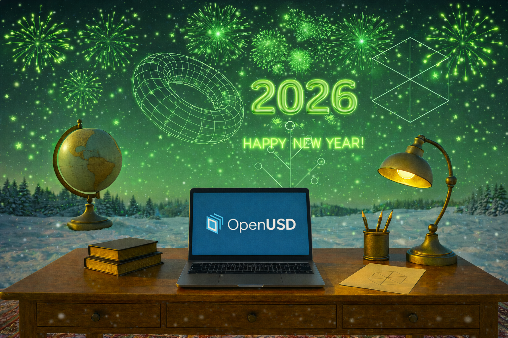

# Welcome to the OpenUSD Studierstube! 🚀

Welcome to the **OpenUSD Studierstube** — your virtual learning space for **[Universal Scene Description (OpenUSD)](https://docs.nvidia.com/learn-openusd/latest/what-openusd/index.html)**.

Together, we explore OpenUSD fundamentals and follow the official [**OpenUSD Learning Path**](https://docs.nvidia.com/learn-openusd/latest/index.html), preparing step by step for the [**NVIDIA OpenUSD Certification**](https://www.nvidia.com/en-us/learn/certification/openusd-development-professional/).

Whether you are just getting started or already working with OpenUSD, the Studierstube is a place to learn, discuss, and grow together.

## What to expect

Every **Friday at 3:00 PM (CEST)**, we meet for a live session in Discord: https://discord.com/invite/vQNV3XXVZ

- We work through the **free [OpenUSD Learning Path](https://docs.nvidia.com/learn-openusd/latest/index.html) **together
- Typically, we cover **one learning unit per session**
- We discuss key concepts, practical implications, and open questions
- Space is always left for **discussion, questions, and shared insights**

Everyone is welcome — curiosity matters more than prior knowledge.

## This website supports you

- This website acts as your digital companion for the OpenUSD Studierstube:
  - **📚 Materials & resources**
     Curated links and additional material related to the OpenUSD Learning Path
  - **🎥 Session recordings**
     Watch past meetings anytime if you couldn’t attend live
  - **❓ FAQ & questions**
     Common questions and clarifications from our discussions
  - **📝 Notes & summaries**
     Key takeaways and condensed explanations from each session

## Joining is easy!

If you’d like to participate in the virtual sessions, simply join on Discord: https://discord.com/invite/vQNV3XXVZ

!!! success "Ready for the certification?"

We’ll get there together! The OpenUSD Studierstube makes it as easy as possible to get started with Universal Scene Description (USD). 

Head to the [certification](https://www.nvidia.com/en-us/learn/certification/openusd-development-professional/).

## What does “Studierstube” mean?

“[Studierstube](https://de.wiktionary.org/wiki/Studierstube)” literally means *study room* - a somewhat old-fashioned German word.

The group originally started in 2025 as a German-speaking study circle, and the name stuck.
Due to growing interest from non-German speakers, we switched to **English in 2026**, while keeping the spirit:
a focused, friendly space for learning together.