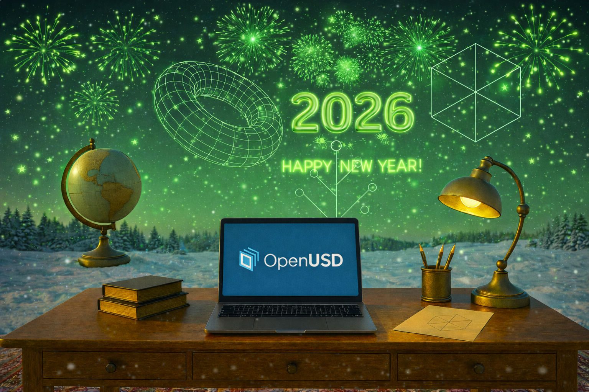

# Welcome to the OpenUSD Studierstube! 🚀

Welcome to the **OpenUSD Studierstube** — your virtual learning space for **[Universal Scene Description (OpenUSD)](https://docs.nvidia.com/learn-openusd/latest/what-openusd/index.html)**.

Together, we explore OpenUSD fundamentals and follow the official [**OpenUSD Learning Path**](https://docs.nvidia.com/learn-openusd/latest/index.html), preparing step by step for the [**NVIDIA OpenUSD Certification**](https://www.nvidia.com/en-us/learn/certification/openusd-development-professional/).

Whether you are just getting started or already working with OpenUSD, the Studierstube is a place to learn, discuss, and grow together.

## What to expect

Every **Friday at 3:00 PM (CEST)**, we meet for a live session in [Discord](https://discord.com/invite/nvidiaomniverse) in the [Community Room]( https://discord.gg/kHWypa7u ) 

The Channel to Chat is here:  [OpenUSD Studierstube Channel](https://discord.com/channels/827959428476174346/1532362789031510136) .

We started as a study group working through the official OpenUSD Learning Path to prepare for the OpenUSD Certification. Today, we also explore the wider OpenUSD ecosystem, including Digital Twins, Physical AI, and other topics enabled by OpenUSD.

Together we:

- 📚 Work through the OpenUSD Learning Path and other resources such as OpenUSD in a Weekend
- 💬 Discuss OpenUSD, Digital Twins, Physical AI, and related technologies
- 🛠️ Build projects and experiments
- 🎨 Share our own OpenUSD work, demos, and discoveries

#### If you don't have access to the Community Room: 

Attendees need to be verified members of the Omniverse Discord. If people just joined the Omniverse Discord for our study group, here’s the process:

1. Complete the short questionnaire in Hashtag #apply-for-access (also in the Welcome category)

2. Either Edmar or Amelia will approve them

3. Once approved, pick your preferred roles in Hashtag⁠roles so you get relevant notifications

   

Whether you're preparing for certification or simply interested in OpenUSD, you're welcome to learn and build with us.

## This website supports you

- This website acts as your digital companion for the OpenUSD Studierstube:
  - **📚 Materials & resources**
     Curated links and additional material related to the OpenUSD Learning Path
  - **🎥 Session recordings**
     Watch past meetings anytime if you couldn’t attend live
  - **❓ FAQ & questions**
     Common questions and clarifications from our discussions
  - **📝 Notes & summaries**
     Key takeaways and condensed explanations from each session

## Joining is easy!

If you’d like to participate in the virtual sessions, simply join on [Discord](https://discord.com/invite/nvidiaomniverse).

!!! success "Ready for the certification?"

We’ll get there together! The OpenUSD Studierstube makes it as easy as possible to get started with Universal Scene Description (USD). 

Head to the [certification](https://www.nvidia.com/en-us/learn/certification/openusd-development-professional/).

## What does “Studierstube” mean?

“[Studierstube](https://de.wiktionary.org/wiki/Studierstube)” literally means *study room* - a somewhat old-fashioned German word.

The group originally started in 2025 as a German-speaking study circle, and the name stuck.
Due to growing interest from non-German speakers, we switched to **English in 2026**, while keeping the spirit:
a focused, friendly space for learning together.