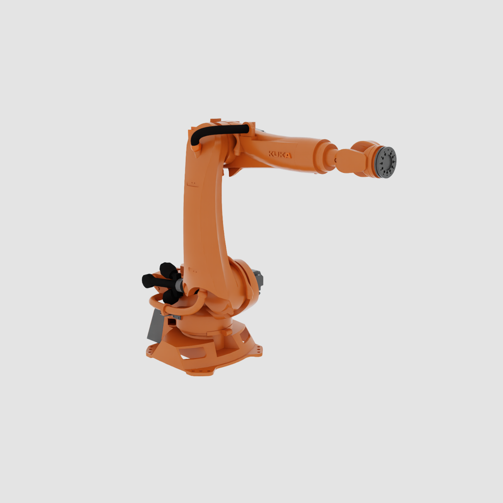
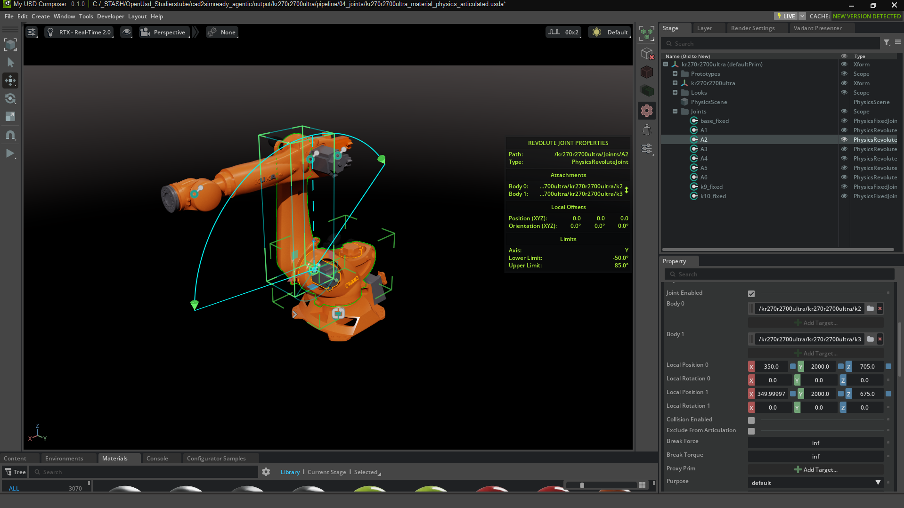
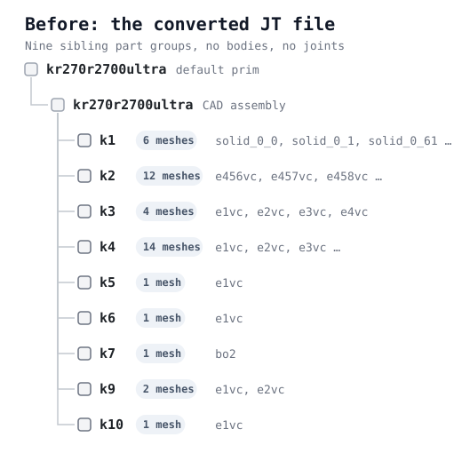
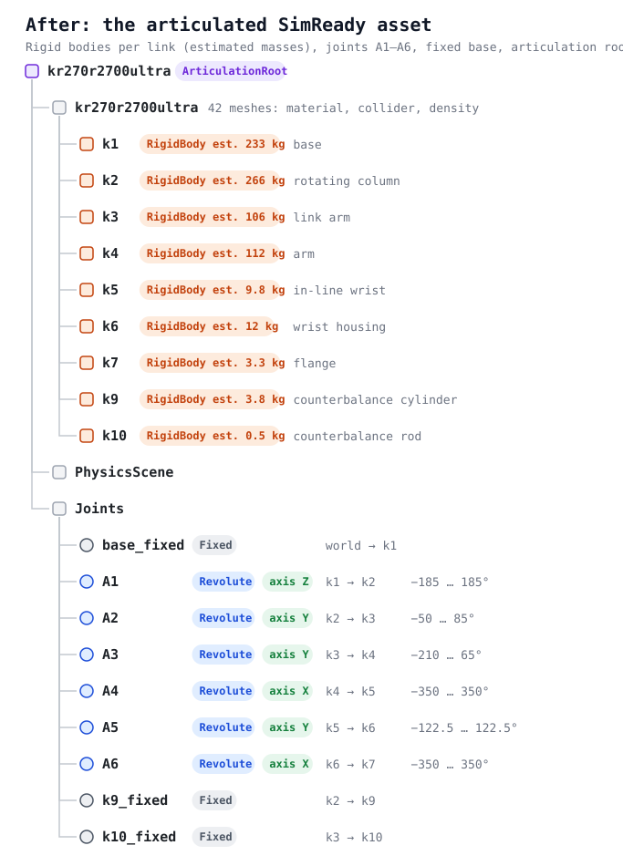

# SimReady robot from a JT file

A KUKA KR 270 R2700 ultra JT file turned into a SimReady OpenUSD asset with AI agents: NVIDIA's
[`omniverse-cad-to-simready`](https://github.com/nvidia/skills) skill driven by Claude Code, the
[USD Content Agents](https://github.com/nvidia-omniverse/content-agents) for materials and physics, and a
datasheet-based rig for the joints.



## Result

The articulated asset in USD Composer, joint A2 selected (revolute about Y, k2 → k3, limits −50° … 85°):



| Before: converted JT | After: articulated SimReady asset |
| --- | --- |
|  |  |

## Contents

| Path | What it is |
| --- | --- |
| `model/kr270r2700ultra.jt.txt` | Where to get the initial model: the JT is not included, download it from [KUKA](https://my.kuka.com/s/product/kr-270-r2700-ultra/01t58000002hnigAAA?language=de&tab=Downloads). Plain geometry, part groups `k1`…`k10`, no kinematic hierarchy, no joints |
| `usd/kr270r2700ultra_converted.usd` | JT → USD (usd-convert-cad): 42 meshes, mm, Z up |
| `usd/kr270r2700ultra_material_physics.usd` | + SimReady materials (Material Agent), colliders, densities, physics materials, mass (Physics Agent) |
| `usd/kr270r2700ultra_articulated.usda` | Over-layer on the file above: one rigid body per link, revolute joints A1–A6 with datasheet limits, angular drives, fixed base, articulation root |
| `specs/robot-kinematics.json` | Datasheet ranges/speeds, link↔axis mapping, pivots fitted from the geometry, CAD home pose |
| `specs/asset-context-research.json` | Web research on the product; its `material_physics_prompt` is fed to the agents |
| `reports/` | Stage reports: material/physics (HTML + per-mesh predictions), drives, conform, validation |
| `images/` | OVRTX render, USD Composer screenshot, before/after hierarchy trees (SVG, generated by `pipeline/make_trees.py`) |
| `pipeline/` | Orchestrator and helper scripts, deployment files for Windows + WSL2 |

Open `usd/kr270r2700ultra_articulated.usda` in any UsdPhysics-aware app, press play and drive the joint targets.

## Reproduce

Prerequisites: NVIDIA GPU, Docker (Desktop + WSL2 on Windows), Python 3.12, `uv`, a coding agent with the skill
(`npx skills add https://github.com/nvidia/skills --skill omniverse-cad-to-simready`) and a VLM provider key in
`~/.omniverse-cad-to-simready/secrets.env`. Download the JT from the
[KUKA product page](https://my.kuka.com/s/product/kr-270-r2700-ultra/01t58000002hnigAAA?language=de&tab=Downloads)
and save it as `model/kr270r2700ultra.jt`.

```powershell
cd pipeline
# Windows only: native OVRTX render service on :8000, wrapped as the Content Agents render API on :8001
python ovrtx_adapter.py --backend http://127.0.0.1:8000 --port 8001
# Material + Physics agents (from WSL2 on Windows)
wsl -d Ubuntu -- bash -l ./deploy_content_agents_wsl.sh openai gpt-5.5

# context -> convert -> minimum gate -> material + physics assignment
py -3.12 cad2simready.py ..\model\kr270r2700ultra.jt --to assign --assign-timeout 7200

# joints from the datasheet spec (copy specs/robot-kinematics.json to output/<asset>/pipeline/01_context/ first)
python author_robot_drives.py output\kr270r2700ultra\pipeline\04_assign\physics\kr270r2700ultra_material_physics.usd - `
    output\kr270r2700ultra\pipeline\04_joints\kr270r2700ultra_articulated.usda `
    --kinematics output\kr270r2700ultra\pipeline\01_context\robot-kinematics.json --report drives.json

# SimReady conform + validation + render
py -3.12 cad2simready.py ..\model\kr270r2700ultra.jt --from conform
```

`author_robot_drives.py` needs `usd-core` and `numpy`. `cad2simready.py --joints` additionally submits the asset to the
Joint Agent (research preview, `deploy_joint_agent_wsl.sh`) and only uses its output as a cross-check.

## Status and known gaps

- Physics and geometry validation pass; the articulated layer passes the physics validator with 0 errors.
- SimReady profile `Prop-Robotics-Neutral`: GSP.001 (grasp points) needs manually picked points
  (`--grasp-point x,y,z`, twice). The asset gate reports 18 dangling `over` prims from the conversion.
- `reports/pipeline-report.md` is the snapshot from before the joints were added (it still shows the Joint Agent
  block). Conform/validate have not been rerun on the articulated layer.
- Drive gains are estimated from gravity load (the datasheet has no torques); rotation direction for A1/A4/A5/A6 is
  unverified.
- The Joint Agent authored no joints in 5 runs. `pipeline/deploy/` holds the local prompt-library entry and a patched
  `defaults.py` (Apache-2.0, NVIDIA) that enables it.

Datasheet: [KUKA KR 270 R2700 ultra](https://my.kuka.com/s/product/kr-270-r2700-ultra/01t58000002hnigAAA?language=de&tab=Details).
